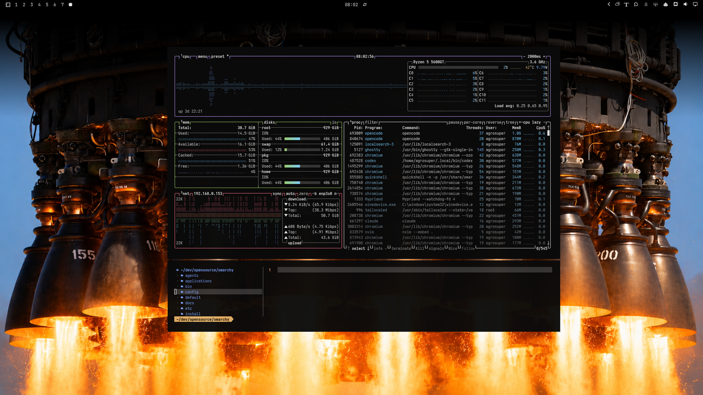
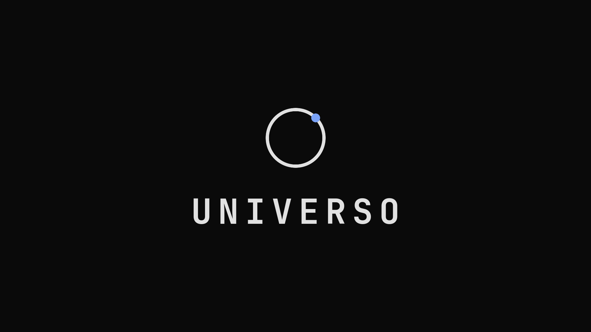
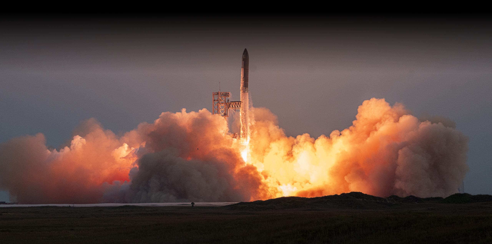
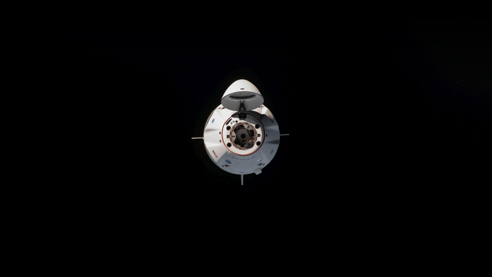
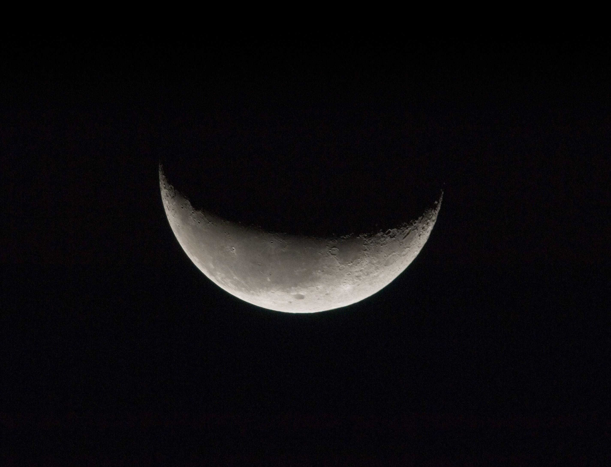
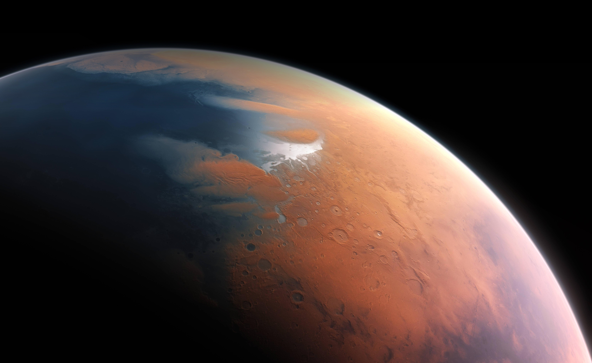

<p align="center">
  
</p>

<p align="center">
  <b>A dark, cinematic Omarchy theme inspired by SpaceX, xAI, and GrokNight.</b><br>
  Void black canvas · neutral gray ramp · TokyoNight accents
</p>

<p align="center">
  
  
  
</p>

---

## Screenshots





| | | |
|---|---|---|
|  |  |  |
|  |  |  |

> Every background ships with a black gradient baked into the top, so the
> transparent bar keeps its labels readable on any photo.

## Features

- 🌌 **6 mission-photography backgrounds** with top gradient for bar legibility
- 🖥️ **Terminals** (ghostty, alacritty, kitty, foot), tmux, btop — generated from `colors.toml`
- ✏️ **Neovim (aether), Helix, Obsidian** — generated from `colors.toml`
- 🧩 **Shell/bar, Hyprland, Mako, Walker, Chromium** — generated from `colors.toml`
- 🔒 **Lock screen** — follows the current background automatically
- 🚀 **Boot splash (Plymouth)** — `unlock.png` + palette
- 💻 **Cursor / VS Code** — packaged `local.theme-universo` extension
- ⚡ **Zed** — hand-tuned `zed.json`
- 🎨 **Icons** — `Yaru-blue` to match the starlight accent
- 🔑 **Login screen (SDDM)** — optional override in `extras/sddm/`

## Install

```bash
omarchy theme install https://github.com/jltrench/omarchy-universo-theme.git
omarchy theme set universo
```

Cycle backgrounds with `omarchy theme bg next`, or pick one:

```bash
omarchy theme bg set ~/.config/omarchy/themes/universo/backgrounds/universo-4.png
```

> Note: a theme installed from a repo cannot ship Lua, terminal configs, or
> `vscode.json` — Omarchy drops them and generates everything from
> `colors.toml` instead (same colors, theme named `Omarchy`). The hand-tuned
> `zed.json` and `vscode-extension/` in this repo apply to local installs;
> on repo installs, import them manually (below).

## Editor setup (manual steps)

**Zed** — not auto-applied on `theme set`:

```bash
mkdir -p ~/.config/zed/themes
cp ~/.config/omarchy/themes/universo/zed.json ~/.config/zed/themes/universo.json
```

**VS Code family** — uses the packaged `Universo` theme (`local.theme-universo`).
Install the local extension once, then:

```bash
omarchy-theme-set-vscode
```

## Boot & login extras

**Plymouth boot splash** (per-theme, needs sudo):

```bash
omarchy plymouth set-by-theme universo
```

**SDDM login override** — full-bleed Universo wallpaper + dim scrim + light
Omarchy wordmark + JetBrainsMono (the stock SDDM theme is a fixed default,
so this lives in `extras/`, not in the theme itself):

```bash
sudo cp /usr/share/sddm/themes/omarchy/Main.qml "/usr/share/sddm/themes/omarchy/Main.qml.bak.$(date +%s)"
sudo cp extras/sddm/Main.qml extras/sddm/logo.png /usr/share/sddm/themes/omarchy/
sudo cp backgrounds/universo-4.png /usr/share/sddm/themes/omarchy/background.png
sddm-greeter --test-mode --theme /usr/share/sddm/themes/omarchy  # preview, Esc quits
```

## Structure

```
omarchy-universo-theme/
├── colors.toml          # single source of truth (GrokNight-based)
├── backgrounds/         # 6 wallpapers with baked top gradient
├── zed.json             # hand-tuned Zed theme
├── vscode.json          # points to the local extension below
├── vscode-extension/    # packaged `local.theme-universo` (Cursor/VS Code)
├── unlock.png           # boot logo (also the header above)
├── preview.png / preview-unlock.png
├── icons.theme          # Yaru-blue
├── extras/sddm/         # optional login-screen override
├── LICENSE
└── README.md
```

## Palette (v2, GrokNight-inspired)

Strongly inspired by GrokNight, the default theme of
`xai-grok-pager-render` in grok-build: neutral gray ramp, TokyoNight
accents, gray chrome with color reserved for content. SpaceX void black
anchors the darkest step. Syntax roles follow `grok-night.tmTheme`.

<details>
<summary>Full token table</summary>

| Role | Hex | Source |
| ---- | --- | ------ |
| Terminal canvas | `#0a0a0a` | GrokNight `BG` |
| Darkest | `#0c0c0c` | GrokNight `BG_DARK` |
| Void | `#000000` | SpaceX canvas |
| Elevated | `#242424` | GrokNight `BG_HIGHLIGHT` |
| Editor canvas | `#0e0e0e` | `grok-night.tmTheme` |
| Primary text | `#e1e1e1` | GrokNight `FG` |
| Secondary text | `#c8c8c8` | GrokNight `FG_DARK` |
| Muted | `#6c6c6c` | GrokNight `COMMENT` |
| Selection | `#363636` | GrokNight `bg_visual` |
| Borders | `#323237` / `#3c3c41` / `#505058` | GrokNight chrome |
| Blue / functions | `#7aa2f7` | TokyoNight |
| Cyan / links | `#7dcfff` | GrokNight `CYAN` |
| Green / strings | `#9ece6a` | TokyoNight |
| Mint / keys | `#73daca` | GrokNight `GREEN1` |
| Magenta / keywords | `#bb9af7` | TokyoNight |
| Orange / numbers | `#ff9e64` | TokyoNight |
| Yellow / types | `#e0af68` | TokyoNight |
| Golden highlight | `#ffdb8d` | GrokNight `accent_plan` |
| Teal / headings | `#1abc9c` | GrokNight `TEAL` |
| Comment (code) | `#51597d` italic | `grok-night.tmTheme` |
| Operator | `#89ddff` | `grok-night.tmTheme` |
| Abort red | `#f7768e` | TokyoNight |

</details>

#### Recommendations for 3rd-party app theming

Using Bypass Theme-Hook script for GTK, Vesktop, Steam, Spotify etc:
https://github.com/imbypass/omarchy-theme-hook

## Credits

- Palette: GrokNight (`grok-build`), TokyoNight accents, SpaceX void
- Engine: [aether](https://github.com/bjarneo/aether) via Omarchy templates
- Theme format & docs inspired by [HANCORE](https://github.com/HANCORE-linux) themes

## License

MIT — see [LICENSE](LICENSE).
